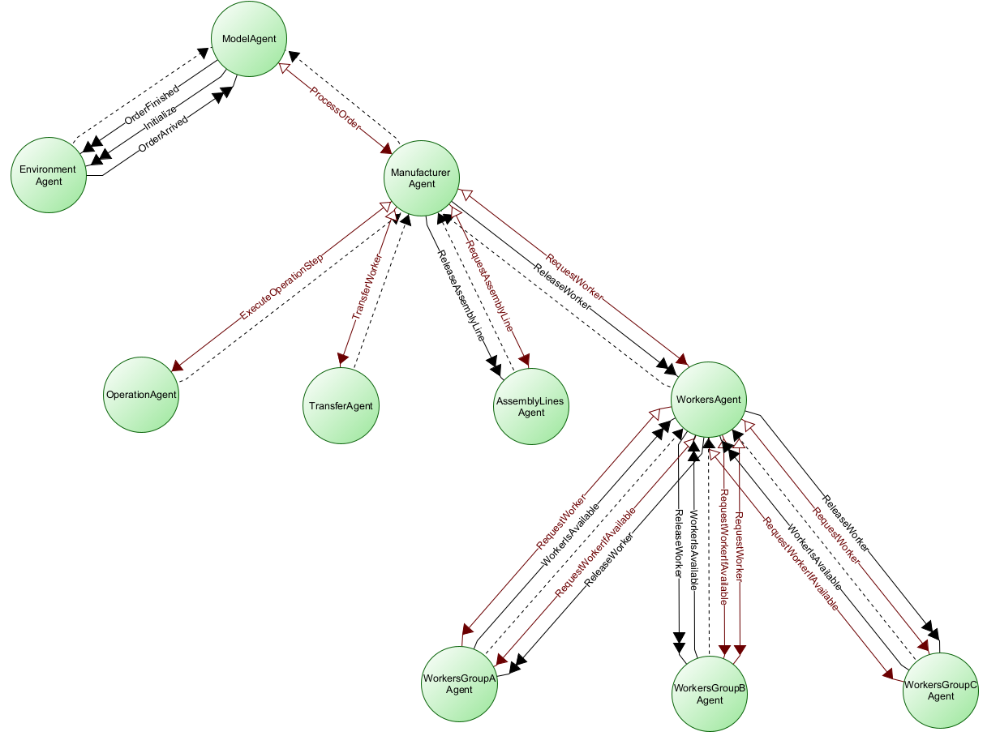
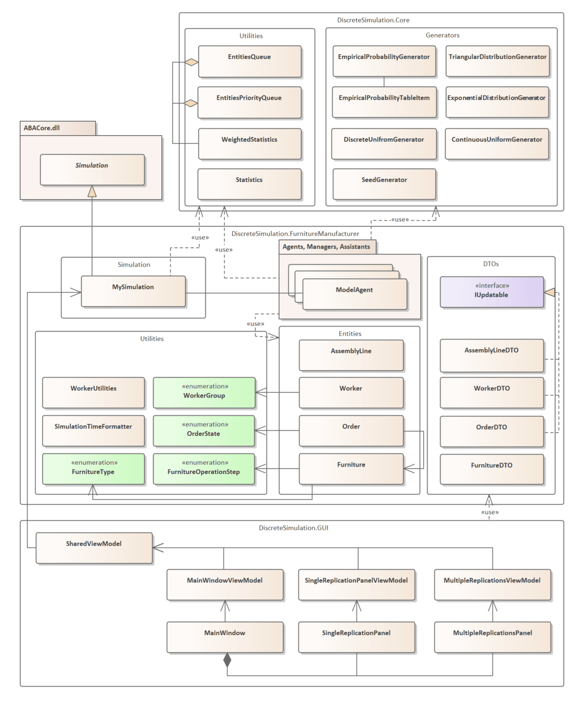
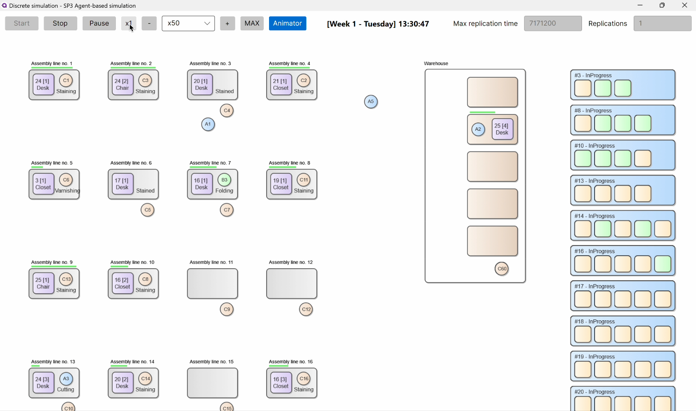
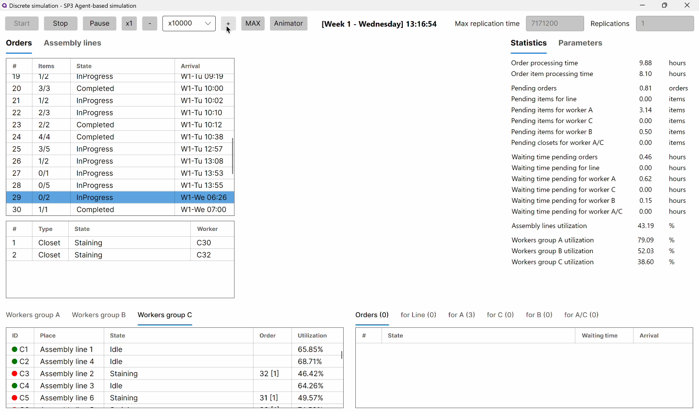
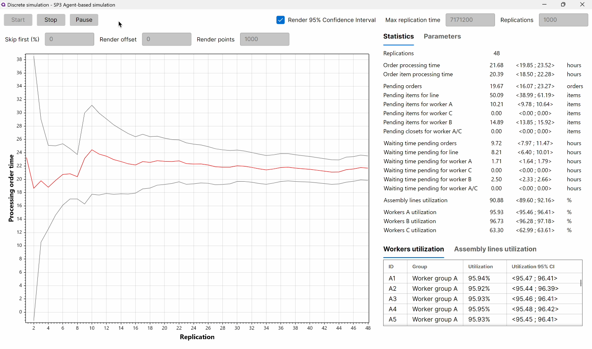

# 🪑 Furniture manufacturer Agent-based Simulation
This project simulates the operations of a furniture manufacturer using agent-based simulation techniques. The simulation models the workflow of furniture production, including the processing of orders containing different types of furniture, material handling, and worker assignments. The objective is to analyze the efficiency of the production process and determine the optimal number of employees for different groups of workers (A, B, C) and number of assembly lines (L). The simulation is built using .NET and Avalonia for the user interface. Simulation is based on the ABASim agent-based simulation core which has been developed at the Faculty of Management Science and Informatics of the University of Žilina.

The application was developed as the third semester work on the Discrete Simulation course at the Faculty of Management Science and Informatics of the University of Žilina.

## 🎯 Key Objectives
- Determine optimal worker counts per group (A/B/C)
- Determine optimal number of assembly lines (L)
- Ensure average order processing time (all furniture items) < 32 working hours
- Design of simulation experiments to find optimal configuration
- Statistical analysis of simulation results (using 95% confidence intervals)
- Implement detailed animation of the simulation process

## 🛠️ Core Features
- 🕹️ Two simulation modes:
  - **Single-run**: Detailed workflow visualization with animations
  - **Multi-run**: Statistical analysis with 95% confidence intervals
- 🔧 Customizable parameters:
  - Worker counts per group (A/B/C)
  - Number of assembly lines (L)
  - Simulation duration (249 work days)
- 📊 Real-time monitoring:
  - Order queue lengths
  - Worker utilization rates
  - Production stage durations
  - Other statistics
- 📈 Convergence trends visualization for average processing order time
- ⏱️ Accelaration and deceleration of simulation run speed
- 🎞️ Animation of workers, assembly lines, and order processing
- 🧮 Parallel configuration analyzer for running multiple simulation instances

## 🚀 Video Preview
...

## 🏭 Simulation Scenario
Models a furniture workshop order that consists of multiple furniture items (1 to 5). Each item can be one of the following types:
- 🟫 **Tables** (50% of orders)
- 🪑 **Chairs** (15%)
- 🚪 **Closets** (35%)

### Production Workflow
1. **Assembly Line**: 🤖 Assignment order furniture item to free assembly line
2. **Group A**: 🪚 Material preparation and cutting
3. **Group C**: 🖌️ Staining
4. **Group C**: 🖌️ Varnishing (15% of items)
5. **Group B**: 🛠️ Assembly
6. **Group A or C**: 🪛 Fittings installation (wardrobes only)

### Key Parameters
- Order arrival: Poisson process (λ=2 orders/hour)
- Order items count: Uniform distribution (1 to 5 items)
- Worker movement times: Triangular distributions
- Processing times vary by furniture type (see documentation)

## 👨🏻‍💼 Agents Hierarchy Diagram

    
    

        <em>Hieararchy of logic agents (like partitions) and message types between them that allows them to communicate and exchange data.</em>
    

## 🛠️ Program Architecture

    
    

        <em>Simplyfied class diagram of the program architecture without agents, managers and assistants.</em>
    

## 📚 Documentation
[📘 Detailed semester work documentation](docs/documentation.pdf) includes details about:
- Each agent's functionality, message types and assistants
- Heuristic approach for initial solution by analyzing random variables
- Design and analysis of simulation experiments
- Statistical evaluation of results in form of charts and tables

 

<em>Animation of single replication simulation run showing workers, assembly lines and order processing</em>

<em>Single replication simulation showing current state of single replication run with detailed statistics</em>

<em>Multiple replications simulation showing average processing time of order over replications and various statistics as means and 95% confidence intervals</em>

 
 
 

# 🪑 Agentovo-orientovaná simulácia výrobcu nábytku
Tento projekt simuluje prevádzku výrobcu nábytku pomocou agentovo-orientovanej simulácie. Simulácia modeluje pracovný postup výroby nábytku, vrátane spracovania objednávok obsahujúcich rôzne typy nábytku, manipulácie s materiálom a prideľovania pracovníkov. Cieľom je analyzovať efektívnosť výrobného procesu a určiť optimálny počet zamestnancov pre rôzne skupiny pracovníkov (A, B, C) a počet výrobných liniek (L). Simulácia je postavená na .NET a Avalonia pre používateľské rozhranie. Simulácia je založená na agentovo orientovanom simulačnom jadre ABASim, ktoré je vyvíjané na Fakulte riadenia a informatiky Žilinskej univerzity v Žiline.

Aplikácia bola vytvorená ako tretia semestrálna práca v rámci predmetu Diskrétna simulácia na Fakulte riadenia a informatiky Žilinskej univerzity v Žiline.

## 🎯 Hlavné ciele
- Určiť optimálny počet pracovníkov v každej skupine (A/B/C)
- Určiť optimálny počet výrobných liniek (L)
- Zabezpečiť priemerný čas vybavenia objednávky (všetkých položiek nábytku) < 32 pracovných hodín
- Návrh simulačných experimentov na nájdenie optimálnej konfigurácie
- Štatistická analýza výsledkov simulácie (pomocou 95% intervalov spoľahlivosti)
- Implementácia podrobnej animácie simulačného procesu

## 🛠️ Hlavné funkcie
- 🕹️ Dva režimy simulácie:
  - **Jedna replikácia**: Podrobná vizualizácia pracovného postupu s animáciou
  - **Viacnásobné replikácie**: Štatistická analýza s 95% intervalmi spoľahlivosti
- 🔧 Konfigurovateľné parametre:
  - Počet pracovníkov v skupinách (A/B/C)
  - Počet výrobných liniek (L)
  - Doba simulácie (249 pracovných dní)
- 📊 Sledovanie v reálnom čase:
  - Dĺžky frontov objednávok
  - Miera vyťaženia pracovníkov
  - Doba trvania výrobných fáz
  - Ďalšie štatistiky
- 📈 Zobrazenie grafu konvergencie priemerného času vybavenia objednávky
- ⏱️ Zrýchlenie a spomalenie rýchlosti behu simulácie
- 🎞️ Animácia pracovníkov, výrobných liniek a spracovania objednávok
- 🧮 Paralelný analyzátor konfigurácií pre spúšťanie viacerých inštancií simulácie

## 🚀 Video ukážka
...

## 🏭 Simulačný scenár
Modeluje prevádzku stolárskej dielne, kde objednávka pozostáva z viacerých položiek nábytku (1 až 5). Každá položka môže byť jedného z nasledujúcich typov:
- 🟫 **Stoly** (50% objednávok)
- 🪑 **Stoličky** (15%)
- 🚪 **Skrine** (35%)

### Pracovný postup výroby
1. **Výrobná linka**: 🤖 Priradenie položky objednávky k voľnej výrobnej linke
2. **Skupina A**: 🪚 Príprava materiálu a rezanie
3. **Skupina C**: 🖌️ Morenie
4. **Skupina C**: 🖌️ Lakovanie (15% položiek)
5. **Skupina B**: 🛠️ Skladanie
6. **Skupina A alebo C**: 🪛 Montáž kovaní (iba pre skrine)

### Kľúčové parametre
- Príchod objednávok: Poissonov proces (λ=2 objednávky/hod)
- Počet položiek objednávky: Rovnomerné rozdelenie (1 až 5 položiek)
- Časy presunov pracovníkov: Trojuholníkové rozdelenia
- Časy spracovania sa líšia podľa typu nábytku (viď dokumentácia)

## 👨🏻‍💼 Diagram hierarchie agentov

    
    

        <em>Hierarchia logických agentov a typy správ medzi nimi, ktoré umožňujú komunikáciu a výmenu dát.</em>
    

## 🛠️ Architektúra programu

    
    

        <em>Zjednodušený diagram tried architektúry programu bez agentov, manažérov a asistentov.</em>
    

## 📚 Dokumentácia
[📘 Podrobná dokumentácia semestrálnej práce](docs/documentation.pdf) obsahuje podrobnosti o:
- Implementačné detaily každého agenta, typy správ a asistentov
- Heuristický prístup pre nájdenie počiatočného riešenia analýzou náhodných premenných
- Návrh a analýza simulačných experimentov
- Štatistické vyhodnotenie výsledkov vo forme grafov a tabuliek

 

<em>Animácia behu simulácie s ukážkou pracovníkov, výrobných liniek a spracovania objednávok</em>

<em>Simulácia zobrazujúca jednu replikáciu, ktorá zobrazuje aktuálny stav behu simulácie s podrobnými štatistikami</em>

<em>Simulácia s viacerými replikáciami, ktorá zobrazuje graf ustaľovania priemerného času vybavenia objednávky počas replikácií a rôzne štatistiky v podobe priemerov a 95% intervalov spoľahlivosti</em>

